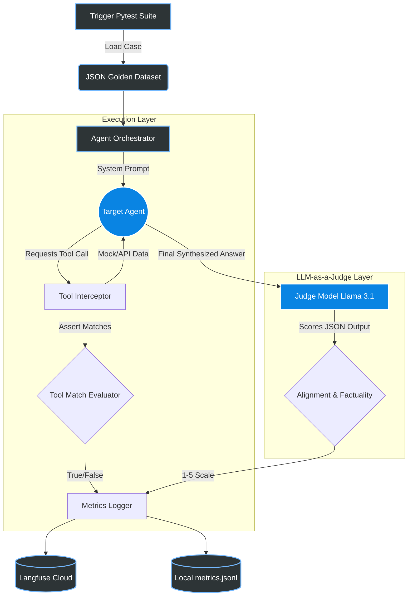

<div align="center">

# 🤖 Agent Evaluation Harness

[](https://python.org)
[](https://langchain.com)
[](https://crewai.com)
[](https://ollama.com)
[](https://langfuse.com)

*An enterprise-grade automated framework designed to programmatically evaluate the tool-calling accuracy, context retention, and reasoning quality of multi-agent AI systems.*

</div>

---

## 🌟 Overview

Testing AI agents against a handful of queries is insufficient for production. The **Agent Eval Harness** utilizes a dual-layer evaluation engine to stress-test your AI systems (LangChain & CrewAI) against **500+ dynamic edge-case scenarios** without relying on expensive, slow human intervention.

### Core Capabilities:
- 🎯 **Deterministic Tool Matching**: Intercepts the LLM payload during execution and mathematically asserts that the exact expected tool and arguments were invoked.
- ⚖️ **LLM-as-a-Judge**: Uses a strict prompt-based local model (`llama3.1`, `temperature=0`) to score agent responses on **Alignment** (1-5) and **Factual Correctness** (1-5).
- 📊 **Real-Time Observability**: Streams all Pytest trace spans, tool execution latencies, and judge scores directly to Langfuse Cloud dashboards.
- 🛡️ **CI/CD Pipeline Defense**: Automatically blocks GitHub PR merges if prompt regressions or AI hallucinations drop the average alignment score below acceptable thresholds.

---

## 🏗️ Architecture & Data Flow

The harness captures evaluation data at multiple layers of execution:



---

## 📂 Project Structure

```text
📦 Agent-Eval-Harness
 ┣ 📂 src                  # Core execution logic
 ┃ ┣ 📜 agent.py           # LangChain Tool-Binding Wrapper
 ┃ ┣ 📜 crewai_agent.py    # CrewAI Evaluation Wrapper
 ┃ ┗ 📜 evaluator.py       # LLM-as-a-Judge Logic
 ┣ 📂 tests                # Pytest evaluation suite
 ┃ ┗ 📜 test_agent_eval.py # Dynamic test generator over 500+ cases
 ┣ 📂 data                 
 ┃ ┣ 📜 test_cases.json    # The Golden Dataset
 ┃ ┗ 📜 metrics.jsonl      # Local latency/score persistence
 ┗ 📂 documentation        # Architecture deep-dives & Timelines
```

---

## 🚀 Quick Start

### 1. Installation
Clone the repository and install dependencies in an isolated environment:
```bash
python -m venv venv
# On Windows: .\venv\Scripts\Activate.ps1
# On Mac/Linux: source venv/bin/activate
pip install -r requirements.txt
```

### 2. Local Model Setup
Ensure the [Ollama Daemon](https://ollama.com/) is running locally, and pull the required model (we use Llama 3.1 to natively support API tool schema structures):
```bash
ollama pull llama3.1
```

### 3. Observability Credentials (Optional)
To unlock the real-time cloud dashboards, create a `.env` file in the root directory:
```env
LANGFUSE_PUBLIC_KEY="pk-lf-..."
LANGFUSE_SECRET_KEY="sk-lf-..."
LANGFUSE_HOST="https://cloud.langfuse.com"
```

### 4. Run the Harness
Execute the Pytest suite. The `-v` flag provides verbose trace output for each dynamic case:
```bash
pytest tests/test_agent_eval.py -v
```

---

## 📈 Status & Roadmap

- [x] **Phase 1**: Core Evaluation Engine & Test Data (500+ Cases)
- [x] **Phase 2**: Agent Integration (LangChain & CrewAI Support)
- [x] **Phase 3**: Observability Dashboards (Langfuse)
- [x] **Phase 4**: CI/CD Pipeline Integration (GitHub Actions)
- [x] **Phase 5**: Framework Optimization (Type-coercion matchers & Context Mocks)

> *For a deeper technical dive into the design choices, please see the [Architecture Overview](documentation/ARCHITECTURE_AND_WORK.md).*
